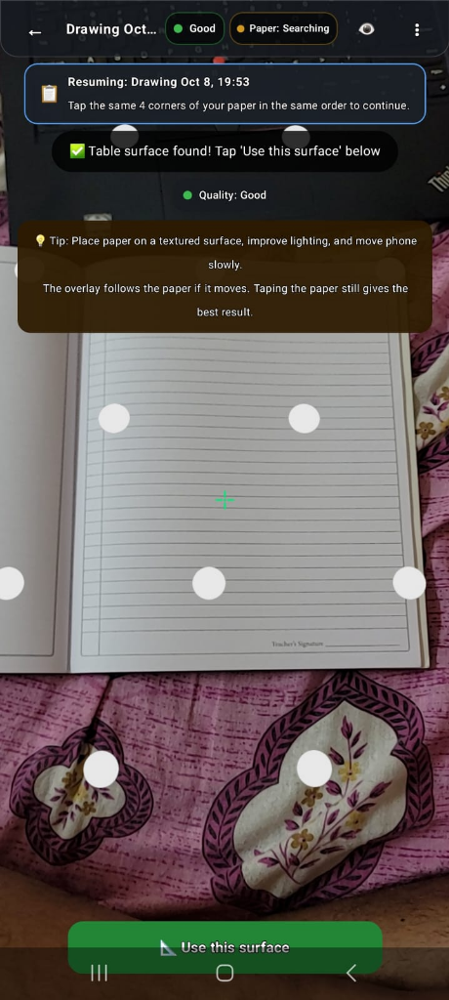
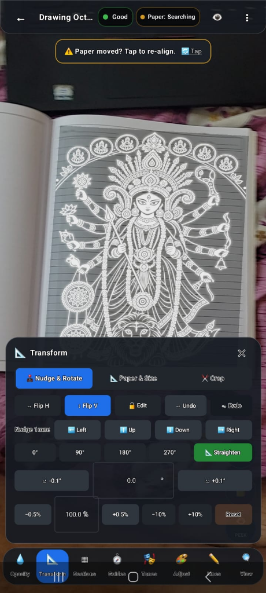
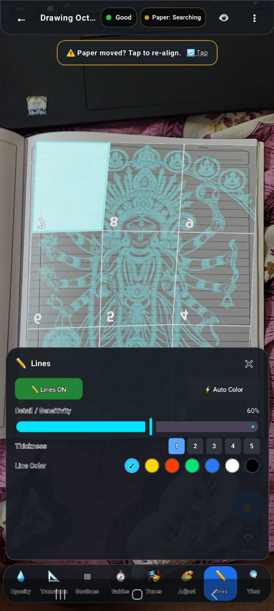
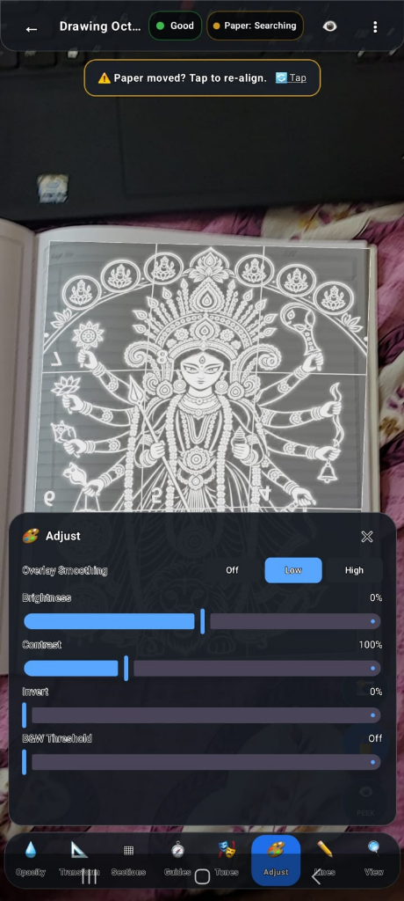
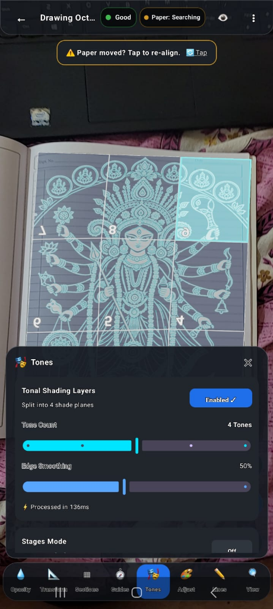

# TraceAR (`ar_drawing_app`)

[](https://github.com/saptarshidas578/ar_drawing_app/actions/workflows/ci.yml)
[](LICENSE)
[-brightgreen.svg)](https://developer.android.com)
[](https://developers.google.com/ar)
[-success.svg)](PRIVACY.md)

> **Trace, sketch, and shade any reference image onto physical paper with precision augmented reality.**

TraceAR turns your Android smartphone into a modern, optical *camera lucida*. Mount your phone above a sheet of paper on a desk, and the app projects your reference artwork directly onto the physical paper in real time. As you move, tilt, or adjust your viewing angle, the virtual drawing stays locked to the desk surface so you can trace contours, place proportions, and shade pencil values with millimeter accuracy.

---

## 📸 Screenshots & Demos

| 1. Table Detection | 2. Optical Tracing & Transform | 3. Lines & Section Grid |
| :---: | :---: | :---: |
|  |  |  |
| *AR table surface detection* | *Projected art with transform dock* | *Canny lines with snake-order grid* |

| 4. Real-Time Adjustments | 5. Tonal Shading Layers |
| :---: | :---: |
|  |  |
| *Brightness, contrast & invert* | *4-plane luminance quantization* |

*(For higher-resolution captures and details on additional media assets, see [`docs/images/README.md`](docs/images/README.md).)*

---

## 🌟 Key Features

### 📐 Augmented Reality Projection & Table Lock
- **Rigid Tabletop Anchoring**: Calibrates against the physical desk plane using Google ARCore and SceneView / Filament.
- **Sub-Millimeter Corner Unprojection**: Calculates analytical ray-plane intersections for corner marking rather than relying on sparse ARCore hit tests.
- **Dynamic Paper Tracking ("Paper Lock")**: Follows small physical shifts and rotations of the paper $(\Delta x, \Delta z, \Delta \theta)$ using fused OpenCV edge detection and ORB feature template matching.
- **Automated Paper Detection**: Detects rectangular paper boundaries automatically via OpenCV or allows 4 manual corner taps.

### 🧭 Classic On-Paper Drawing Guides
- **Proportion Grids**: Divide the drawing area into manageable squares by count (2x2 to 20x20) or by physical centimeter spacing (e.g. 2 cm grid squares).
- **Chessboard Coordinates**: Clear alphanumeric cell badges (A1, B2) that smoothly fade out when zooming in past 2.5x so they never obstruct fine pencil tracing.
- **Composition Construction Lines**: Overlay Golden Ratio lines ($\Phi \approx 0.618$), Rule of Thirds ($1/3, 2/3$), Center Crosshair (`─`, `│`), and Corner Diagonals (`✕`).

### 🎨 Tonal Layers & Value Shading
- **Luminance Quantization**: Splits reference photos into 2 to 6 discrete value planes (Highlights to Deep Shadows) using edge-preserving bilateral filtering (`Imgproc.bilateralFilter`).
- **Solo & Layer Controls**: Isolate individual tonal planes or toggle high-contrast slate, cyan, or sepia color ramps.
- **Portrait Stages Mode**: Guides artists step-by-step through classical academic drawing stages (Outline $\to$ Tone 1 $\to$ Tone 2 $\to$ Tone 3).
- **Interactive Eyedropper**: Tap anywhere on the reference image or physical paper to inspect exact tone values.

### 🔍 Precision Image Controls & Sections
- **Lines-Only Extraction**: Instant OpenCV Canny edge extraction with adjustable sensitivity sliders.
- **Hardware Image Adjustments**: Real-time sliders for overlay smoothing, brightness, contrast, color inversion (for dark paper tracing), and black & white threshold.
- **Section Grid & 4x Zoom**: Magnify fine details from 1x to 4x. Navigate complex illustrations block-by-block in snake order with completion checkboxes.
- **Transform & Nudge**: Nudge artwork in 1 mm increments, rotate by 90° or ±0.1°, straighten to paper margins, or flip horizontally/vertically.

### 📸 Capture, Rectify & Timelapse Export
- **Photo Capture**: Saves clean drawing captures or full AR tracing composites to your gallery via modern Android `MediaStore` (`Pictures/TraceAR`).
- **Rectified Paper Scan**: Perspective-warps the 4 tracked paper corners into a flat, top-down rectangular scan of your finished artwork.
- **Hardware-Accelerated Timelapse**: Records tracing sessions into smooth 720p/1080p MP4 videos using `MediaCodec` (H.264) + `MediaMuxer`.

---

## 💡 How It Works (In Plain Language)

1. **The Table is the Working Plane**: Thin paper is hard for AR cameras to track alone. Instead, TraceAR finds your textured desk surface and locks an anchor to it.
2. **Four Paper Corners**: You tap the four corners of your real paper. The app unprojects rays from your phone screen to the table plane, defining a quadrilateral.
3. **Paper-Normalized Space (`u, v`)**: The artwork is mapped from `0.0` to `1.0` within those corners. Saved projects only store these normalized coordinates, making drawings 100% portable across different tables, cameras, and paper sizes.
4. **Paper Lock**: If your hand accidentally nudges the paper, a background computer vision tracker detects the displacement and shifts the virtual drawing to follow your real page.

---

## 📋 System Requirements

- **Physical Android Phone**: A device certified for [Google Play Services for AR (ARCore)](https://developers.google.com/ar/devices).
- **Android OS**: Android 7.0 (API level 24) or newer *(Target SDK: Android 15 / API level 35)*.
- **Development Tooling**:
  - Android Studio Ladybug (2024.2.1) or newer
  - Java Development Kit (JDK) 17
  - Android SDK Platform 35

> [!NOTE]
> **Android Emulator Notice**: The Android Studio Virtual Device (emulator) cannot simulate realistic ARCore 6-DOF camera tracking and OpenCV surface vision. Always build and test on a physical phone.

---

## 🚀 Build & Run for Beginners

### 1. Clone the Repository
```bash
git clone https://github.com/saptarshidas578/ar_drawing_app.git
cd ar_drawing_app
```

### 2. Open in Android Studio
1. Launch Android Studio and click **Open**.
2. Select the `ar_drawing_app` folder.
3. Wait for Gradle sync to complete automatically.

### 3. Connect Your Phone
1. On your Android phone, enable **Developer Options** and turn on **USB Debugging**.
2. Connect your phone to your computer via USB.
3. In Android Studio's device selector at the top, choose your physical phone.

### 4. Run the App
Click the green **Run (▶)** button (or press `Shift + F10`). The app will compile and launch directly on your device.

To run tests from the command line:
```bash
./gradlew testDebugUnitTest
```

---

## 📖 Quick Usage Guide

1. **Mount Your Phone**: Put your phone in a desk stand or on a sturdy mug ~40–60 cm above your drawing paper, angled downward.
2. **Detect Table**: Aim at the desk surface and slowly move the phone side-to-side until the green banner says *"Table surface found!"*, then tap **"Use this surface"**.
3. **Calibrate Paper**: Tap the 4 corners of your paper (or tap **"Detect Paper"**).
4. **Position Reference**: Use the **Transform** sheet to nudge, scale, or rotate the image.
5. **Trace**: Look at your phone screen and use a real pencil to trace the projected lines onto the real paper!

---

## ⚠️ Known Limitations

- **Featureless White Desks**: ARCore requires visual texture to track motion. Plain white paper on an identical solid-white desk provides few visual features; placing a patterned placemat, cutting mat, or wooden board underneath helps tracking tremendously.
- **Glossy Surfaces & Low Light**: Glare from desk lamps or dim lighting can degrade tracking accuracy. Use the in-app **Torch** button in dim rooms.
- **Paper Lock Dynamics**: Paper Lock works best with gentle, smooth paper movements. Rapid jerking of the paper (>1 cm per frame) will pause tracking to avoid false jumps.
- **Session Drift**: Over very long sessions (>30 minutes), IMU sensor drift can cause slight offsets. Tap the *"Paper moved? Tap to re-align"* banner or re-calibrate the 4 corners to restore alignment.

---

## 🗺️ Roadmap (Future Enhancements)

- [ ] Multi-page sketchbook project support.
- [ ] Bluetooth pedal shutter support for hands-free photo snapshots.
- [ ] Direct SVG vector file import.
- [ ] Advanced edge vectorization with Bézier curve smoothing.

---

## 📚 Project Documentation

- [`docs/ARCHITECTURE.md`](docs/ARCHITECTURE.md): Technical deep-dive, coordinate spaces, and Mermaid system diagram.
- [`docs/USER_GUIDE.md`](docs/USER_GUIDE.md): Complete artist workflow and feature manual.
- [`docs/DEVELOPMENT.md`](docs/DEVELOPMENT.md): Developer environment, lint, testing, and contribution commands.
- [`docs/TROUBLESHOOTING.md`](docs/TROUBLESHOOTING.md): Problem-solving guide for lighting, drift, and calibration.
- [`docs/DECISIONS.md`](docs/DECISIONS.md): Architectural Decision Records (ADRs).
- [`docs/ai-workflow/README.md`](docs/ai-workflow/README.md): AI pair-programming methodology and prompt sequence.
- [`PRIVACY.md`](PRIVACY.md): 100% on-device privacy guarantee.
- [`THIRD_PARTY_NOTICES.md`](THIRD_PARTY_NOTICES.md): Open-source licenses and library attributions.

---

## 📄 License & Acknowledgments

This project is licensed under the [MIT License](LICENSE).

Special thanks to the open-source projects that make TraceAR possible:
- [Google ARCore](https://github.com/google-ar/arcore-android-sdk) — 6-DOF tracking & environmental understanding.
- [SceneView Android](https://github.com/SceneView/sceneview-android) & [Google Filament](https://github.com/google/filament) — Real-time 3D graphics rendering.
- [OpenCV for Android](https://opencv.org/) — Computer vision, Canny edge detection, bilateral filtering, and perspective warping.
- [Jetpack Compose](https://developer.android.com/jetpack/compose) — Modern declarative Android UI toolkit.

---

## Author & Contact

- **Author:** [saptarshi2007 (saptarshidas578)](https://github.com/saptarshidas578)
- **Institution:** B.Tech Electrical & Computer Science Engineering, VIT Vellore
- **LinkedIn:** TODO(author): add link
