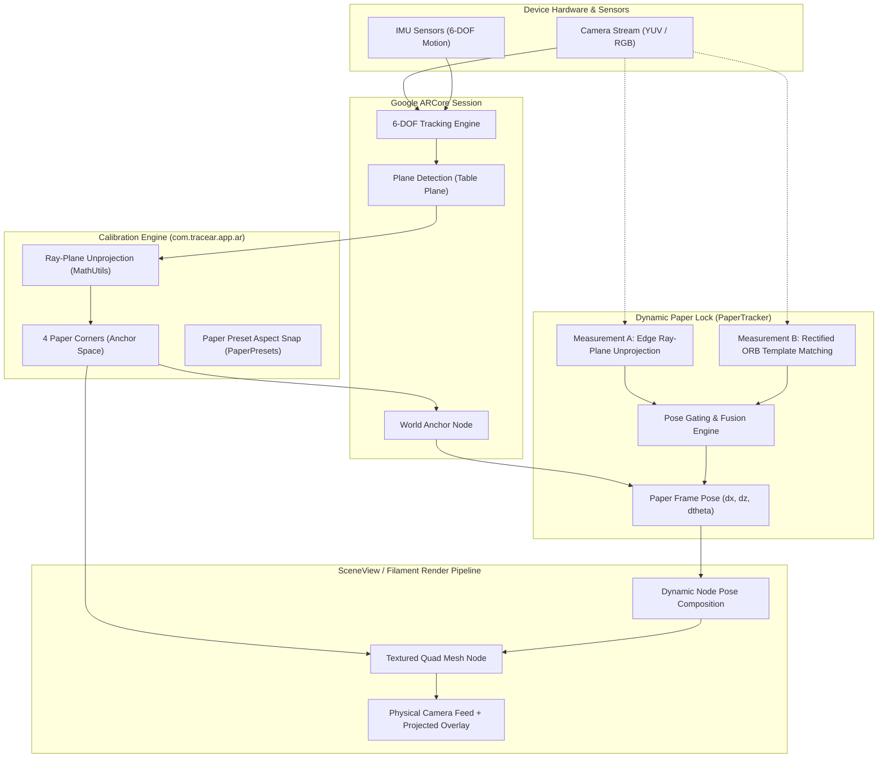

# Architecture & Technical Design — TraceAR (`ar_drawing_app`)

TraceAR transforms a physical Android smartphone into an optical camera lucida drawing projector using **Google ARCore**, **SceneView / Filament**, **OpenCV**, and **Jetpack Compose**.

---

## 1. High-Level System Architecture & Data Flow



---

## 2. Module & Package Inventory

The application consists of a single `:app` module structured into focused packages:

### `com.tracear.app.ar` — Augmented Reality, Geometry & Computer Vision
- [`CalibrationState.kt`](../app/src/main/java/com/tracear/app/ar/CalibrationState.kt): State machine for 4-corner tap calibration and marker manipulation.
- [`SurfaceState.kt`](../app/src/main/java/com/tracear/app/ar/SurfaceState.kt): Table plane detection, reticle state, quality estimation, and surface locking.
- [`MathUtils.kt`](../app/src/main/java/com/tracear/app/ar/MathUtils.kt): Pure math algorithms: ray-plane intersection, quad sorting, homography, unit conversions.
- [`PaperFrame.kt`](../app/src/main/java/com/tracear/app/ar/PaperFrame.kt): Immutable 2D rigid pose (`dx, dz, dθ`) describing paper displacement on the table plane.
- [`RigidTransform2D.kt`](../app/src/main/java/com/tracear/app/ar/RigidTransform2D.kt): 2D rigid transformation algebra, composition, matrix conversion, and inversion.
- [`PaperTracker.kt`](../app/src/main/java/com/tracear/app/ar/PaperTracker.kt): Dynamic Paper Lock engine fusing edge unprojection and ORB feature template matching.
- [`PaperLockFilter.kt`](../app/src/main/java/com/tracear/app/ar/PaperLockFilter.kt): Temporal gating, deadband thresholds, and smoothing filters for Paper Lock poses.
- [`PaperLockState.kt`](../app/src/main/java/com/tracear/app/ar/PaperLockState.kt): UI state container for Paper Lock status, confidence, and offset readouts.
- [`PoseFilter.kt`](../app/src/main/java/com/tracear/app/ar/PoseFilter.kt): General-purpose exponential smoothing filter for 3D coordinates and camera poses.
- [`PaperDetector.kt`](../app/src/main/java/com/tracear/app/ar/PaperDetector.kt): OpenCV automated paper contour detection using adaptive thresholding and polygon approximation.
- [`PaperPresets.kt`](../app/src/main/java/com/tracear/app/ar/PaperPresets.kt): Standard paper dimensions (A4, A3, Letter) and aspect ratio snapping logic.
- [`ImageLineExtractor.kt`](../app/src/main/java/com/tracear/app/ar/ImageLineExtractor.kt): OpenCV Canny edge extraction converting photos to clean line overlays.
- [`ImageAdjustments.kt`](../app/src/main/java/com/tracear/app/ar/ImageAdjustments.kt): Hardware image adjustments (brightness, contrast, inversion, B&W thresholding).
- [`TonalProcessor.kt`](../app/src/main/java/com/tracear/app/ar/TonalProcessor.kt): OpenCV bilateral filtering and luminance quantization into discrete shading planes.
- [`TonalModel.kt`](../app/src/main/java/com/tracear/app/ar/TonalModel.kt): Data structures for tonal layers, color ramps, and solo state.
- [`GuidesModel.kt`](../app/src/main/java/com/tracear/app/ar/GuidesModel.kt): Proportion grid and composition guide generation in paper-normalized space.
- [`TracingOverlay.kt`](../app/src/main/java/com/tracear/app/ar/TracingOverlay.kt): SceneView / Filament textured quad mesh lifecycle and GPU memory management.
- [`TransformUndoManager.kt`](../app/src/main/java/com/tracear/app/ar/TransformUndoManager.kt): Undo/redo history manager for image manipulation.
- [`GridState.kt`](../app/src/main/java/com/tracear/app/ar/GridState.kt): Section grid navigation, snake order numbering, and block progress tracking.
- [`LinesOnlyState.kt`](../app/src/main/java/com/tracear/app/ar/LinesOnlyState.kt): UI state for Canny line sensitivity, thickness, and palette colors.

### `com.tracear.app.data` — Persistence & Settings
- [`ProjectModel.kt`](../app/src/main/java/com/tracear/app/data/ProjectModel.kt): Serializable schema holding paper-normalized corners, image transforms, guides, and metadata.
- [`ProjectRepository.kt`](../app/src/main/java/com/tracear/app/data/ProjectRepository.kt): JSON filesystem persistence in app sandbox (`Context.filesDir`).
- [`AppSettings.kt`](../app/src/main/java/com/tracear/app/data/AppSettings.kt): Centralized persistent preferences via `SharedPreferences`.

### `com.tracear.app.export` — Media Export & Video Encoding
- [`ExportManager.kt`](../app/src/main/java/com/tracear/app/export/ExportManager.kt): PixelCopy GPU surface capture, perspective rectification, and MediaStore gallery writing.
- [`TimelapseEncoder.kt`](../app/src/main/java/com/tracear/app/export/TimelapseEncoder.kt): Hardware-accelerated H.264 `MediaCodec` + `MediaMuxer` video encoding pipeline.
- [`ExportModel.kt`](../app/src/main/java/com/tracear/app/export/ExportModel.kt): Configuration, file formatting, and duration math for exports.

### `com.tracear.app.ui` — Jetpack Compose UI
- [`MainActivity.kt`](../app/src/main/java/com/tracear/app/MainActivity.kt): Single activity host, edge-to-edge window setup, screen awake lock.
- [`TraceARApp.kt`](../app/src/main/java/com/tracear/app/ui/TraceARApp.kt): Top-level navigation composable routing between Home, Tracing, and Settings.
- [`HomeScreen.kt`](../app/src/main/java/com/tracear/app/ui/HomeScreen.kt): Project list gallery, recent drawings, and new project launcher.
- [`ARScreen.kt`](../app/src/main/java/com/tracear/app/ui/ARScreen.kt): Core tracing experience integrating `ARSceneView` with UI docks.
- [`ZoomState.kt`](../app/src/main/java/com/tracear/app/ui/ZoomState.kt): View-level 1x to 4x pinch zoom and pan state.
- [`tracing/*`](../app/src/main/java/com/tracear/app/ui/tracing/): Modular floating UI dock, category sheets, top bar, and quick actions.
- [`tutorial/*`](../app/src/main/java/com/tracear/app/ui/tutorial/): First-run onboarding cards walkthrough.
- [`settings/*`](../app/src/main/java/com/tracear/app/ui/settings/): App settings screen.

---

## 3. The Three Coordinate Spaces

TraceAR rigorously isolates three distinct coordinate frames. Mixing these coordinate frames causes visual jumping or persistence corruption:

```
[World Space (meters)]  <── ARCore Session ──>  [Anchor-Local Space (meters)]  <── Calibration ──>  [Paper-Normalized Space (u,v)]
 (Dynamic, ARCore 6-DOF)                          (Rigid to table plane)                              (Invariant [0,1], Persisted)
```

1. **World Space (meters)**:
   - Defined by ARCore relative to where the phone was when the session started.
   - Origin and axes wander as ARCore refines visual-inertial odometry.
   - **Never persisted to disk** because an ARCore session origin is non-repeatable.
2. **Anchor-Local Space (meters)**:
   - Rigid 3D space defined relative to the single table plane `Anchor` created during calibration.
   - The 4 paper corners and table plane normal are stored in this space during runtime.
   - Y axis is perpendicular to the table; X and Z lie flat on the table surface.
3. **Paper-Normalized Space (`u, v` from `0.0` to `1.0`)**:
   - `u ∈ [0.0, 1.0]` along the paper's top edge (left to right).
   - `v ∈ [0.0, 1.0]` along the paper's left edge (top to bottom).
   - **This is the ONLY coordinate frame saved to disk.**
   - All guides, section grids, crops, and drawing bounds are stored in normalized space, making projects completely independent of physical paper size, camera distance, or table orientation.

---

## 4. Calibration Flow

1. **Surface Hunting**:
   - ARCore detects horizontal planes.
   - Screen center ray is intersected with planes; planes with elevation below a floor threshold (~0.4m below typical table height) are rejected.
2. **Surface Lock**:
   - User taps **"Use this surface"**.
   - A single physical ARCore `Anchor` is instantiated at the ray-plane hit pose.
   - An infinite mathematical plane $P = (\mathbf{p}_0, \hat{\mathbf{n}})$ is locked in anchor-local space.
3. **Corner Marking**:
   - When the user taps a corner on the phone screen (or OpenCV auto-detects corners), the screen coordinate $(x_{px}, y_{px})$ is unprojected into a 3D camera ray using camera intrinsics.
   - The ray is intersected with the locked mathematical plane:
     $$\mathbf{P}_{corner} = \mathbf{P}_{cam} + \frac{(\mathbf{p}_0 - \mathbf{P}_{cam}) \cdot \hat{\mathbf{n}}}{\mathbf{d}_{ray} \cdot \hat{\mathbf{n}}} \mathbf{d}_{ray}$$
   - Corners are auto-sorted into clockwise order: Top-Left, Top-Right, Bottom-Right, Bottom-Left.

---

## 5. Dynamic Paper Lock Design

If the paper slides or rotates on the desk during tracing, **Paper Lock** tracks it without drifting:

1. **Paper Frame Pose**:
   - A 2D rigid transform on the table plane: $T = (\Delta x, \Delta z, \Delta \theta)$.
   - Initialized to identity $(0, 0, 0)$ at calibration.
2. **Dual-Measurement Pipeline**:
   - **Measurement A (Edge Ray-Plane Unprojection)**: Detects high-contrast paper boundaries in camera image and unprojects candidate corner rays onto the table plane, validating against expected side lengths (±5% tolerance).
   - **Measurement B (Rectified ORB Template Matching)**: Generates a 512x512 top-down grayscale patch of the paper interior and performs ORB feature matching with RANSAC homography.
3. **Pose Fusion & Gating**:
   - Temporal gating rejects physical jumps $> 1\text{ cm}$ unless confirmed across 3 consecutive cycles.
   - Deadband filter ignores micro-jitter below $0.5\text{ mm}$ translation or $0.1^\circ$ rotation.
   - Slow template blending updates the reference template during long stationary periods (3s still).
4. **Dynamic Pose Composition**:
   - Composed directly into the SceneView Filament node transform:
     $$\mathbf{T}_{final} = \mathbf{T}_{anchor} \cdot \mathbf{T}_{paper\_frame} \cdot \mathbf{T}_{image\_transform}$$
   - **Zero vertex buffer churn**: saved project data, undo history, and normalized coordinates remain completely untouched.

---

## 6. Persistence & Threading Model

### Persistence Schema (Versioned JSON)
Projects are serialized to `project.json` inside private storage (`Context.filesDir/projects/<id>/`):
- `schemaVersion`: Integer (`1`).
- `corners`: 4 normalized points.
- `transform`: Scale, translation, rotation, flips.
- `guides`: Proportion grid mode, counts, construction line toggles.
- `imageUri`: Sandboxed copy of the reference image.

### Threading Architecture
- **Main Thread (UI)**: Jetpack Compose rendering, user gesture recognition, sheet animations.
- **Render Thread (GPU / Filament)**: SceneView frame loop, camera background blit, 3D textured quad rendering.
- **Background Dispatcher (`Dispatchers.Default`)**:
  - OpenCV image filtering (Canny edge extraction, bilateral smoothing, tonal quantization) debounced at 150 ms.
  - Paper Lock tracking loops (running at 5–10 Hz; throttled to 4 Hz in Battery Saver mode).
- **IO Dispatcher (`Dispatchers.IO`)**:
  - Image file decoding, thumbnail generation, JSON disk reads/writes.
